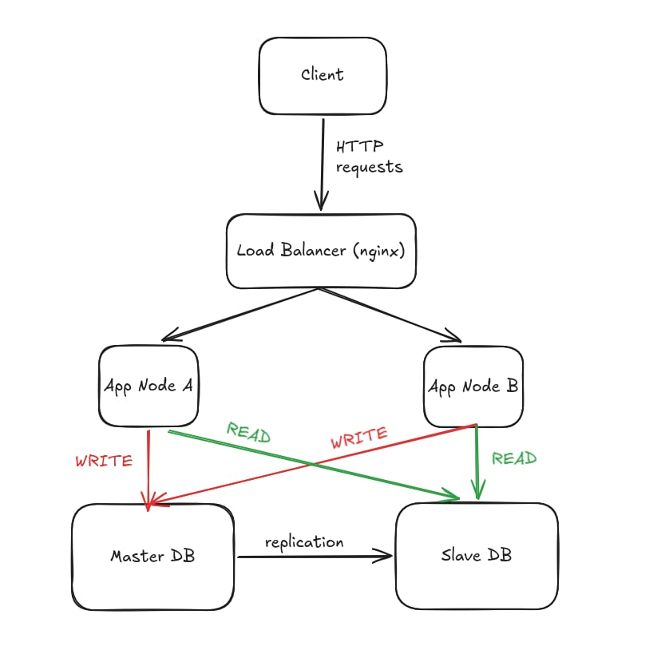

# Technical Documentation: High-Availability API with DB Replication
## Scalable System Design & Implementation Guide

This documentation provides a comprehensive deep dive into a production-ready architecture designed for high availability, fault tolerance, and scalable read/write operations.

---

## 1. System Architecture Overview

The system is designed with a multi-layered approach to ensure zero downtime and data integrity.



### Core Components:
- **Traffic Management Layer**: Nginx acts as a sophisticated reverse proxy and load balancer.
- **Application Layer**: Two identical Django API nodes (`appNodeA`, `appNodeB`) running Gunicorn, allowing for horizontal scaling.
- **Data Persistence Layer**: PostgreSQL Master-Slave cluster.
    - **Master (`db-master`)**: Handles all `INSERT`, `UPDATE`, `DELETE` operations and streams data to the replica.
    - **Slave (`db-slave`)**: Dedicated to `SELECT` operations to offload the primary database.

---

## 2. Technical Configuration Snippets

### 2.1 Resilient Load Balancing (Nginx)
The configuration below implements **Passive Health Checks**. If a node fails, Nginx reroutes the request in real-time.

```nginx
upstream backend {
    # max_fails=1: Marks the node as "down" after a single failure.
    # fail_timeout=10s: Keeps the node in "down" status for 10 seconds before retrying.
    server appNodeA:8000 max_fails=1 fail_timeout=10s;
    server appNodeB:8000 max_fails=1 fail_timeout=10s;
}

location /api/ {
    proxy_pass http://backend;
    
    # Auto-Failover Logic:
    # If a server returns an error or timeout, Nginx tries the next healthy node.
    proxy_next_upstream error timeout http_502 http_503 http_504;
    
    # Fast Connect Timeout: 
    # Ensures the system doesn't hang if a container is unresponsive.
    proxy_connect_timeout 2s;
    
    proxy_set_header Host $http_host;
    proxy_set_header X-Real-IP $remote_addr;
}
```

### 2.2 Fault-Tolerant Database Connection (Django)
Standard DB connections can hang for minutes during network partitions. We implemented strict timeouts to ensure a "fail-fast" behavior.

```python
DATABASES = {
    "default": {
        "ENGINE": "django.db.backends.postgresql",
        "NAME": "products",
        "USER": "melyen",
        "PASSWORD": "Demo@123",
        "HOST": "db-master",
        "PORT": "5432",
        "OPTIONS": { 
            "connect_timeout": 2 # Aborts connection attempt after 2 seconds
        }
    },
    "replica": {
        "ENGINE": "django.db.backends.postgresql",
        "NAME": "products",
        "USER": "melyen",
        "PASSWORD": "Demo@123",
        "HOST": "db-slave",
        "PORT": "5432",
        "OPTIONS": { 
            "connect_timeout": 2, 
            "options": "-c statement_timeout=10000" # Aborts long queries after 10 seconds
        }
    }
}
```

### 2.3 Intelligent Read/Write Splitting (Database Router)
A custom router logic that separates read and write traffic at the ORM level.

```python
class ReadWriteRouter:
    def db_for_read(self, model, **hints):
        """Route all SELECT queries to the read-replica."""
        return "replica" 
        
    def db_for_write(self, model, **hints):
        """Route all INSERT/UPDATE/DELETE queries to the master."""
        return "default"
```

---

## 3. Setup & Reproduction Guide

### Phase 1: Deployment
Deploy the entire stack with a single command. The images are optimized for size and build speed.
```bash
docker compose up --build -d
```

### Phase 2: Verification of High Availability
To prove the system's resilience, perform a controlled failure test:
1. **Stop Node A**: `docker compose stop appNodeA`
2. **Execute Request**: `curl -v http://localhost:8080/api/products/`
3. **Verification**: Observe that Nginx detects the failure and seamlessly fetches data from `appNodeB`.

### Phase 3: Verification of DB Replication
1. **Write data**: Perform a `POST` to `/api/products/`.
2. **Verify Sync**: Check the logs or the slave DB to ensure the data was streamed to the replica.
3. **Fail-Fast Test**: Stop the slave (`docker compose stop db-slave`) and verify that the GET request fails within **2 seconds** instead of hanging.

---

## 4. API Reference Example

| Method | Endpoint | Source DB | Purpose |
|---|---|---|---|
| `POST` | `/api/products/` | Master | Create a new product |
| `GET` | `/api/products/` | Slave | List all products (scalable reads) |

**Sample POST Request:**
```bash
curl -X POST http://localhost:8080/api/products/ \
     -H "Content-Type: application/json" \
     -d '{"name": "Laptop Dell XPS", "price": 1299.99}'
```

**Expected Response:**
```json
{
    "success": true,
    "data": {
        "id": 1,
        "name": "Laptop Dell XPS",
        "price": "1299.99",
        "created_at": "2026-05-01T02:56:46.334751Z"
    },
    "processed_by": "Node_A"
}
```

## 4. Video demo
[Link video](https://youtu.be/W0skp8x7Ssg)
